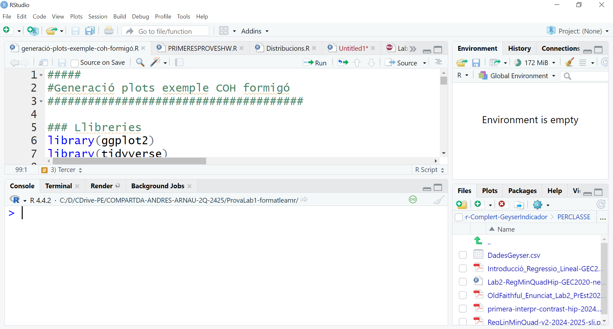
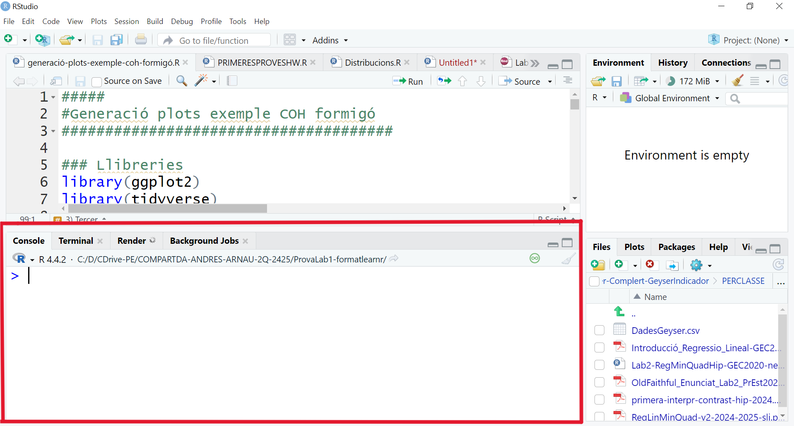
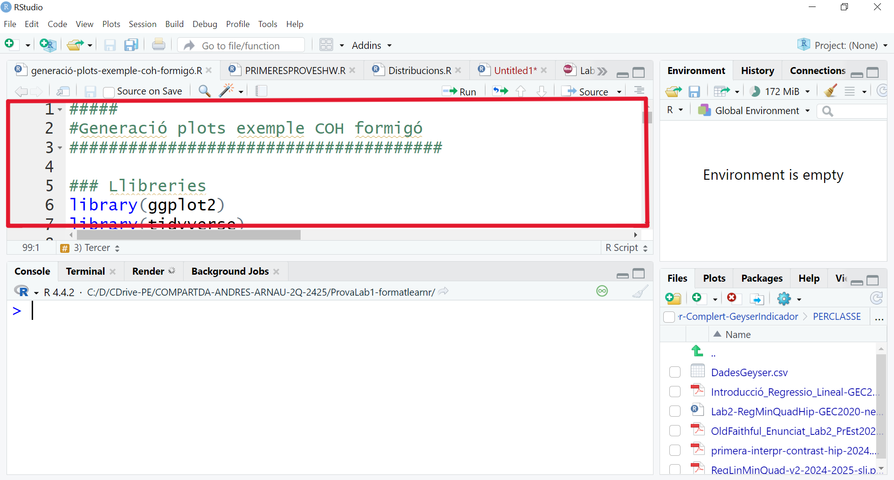
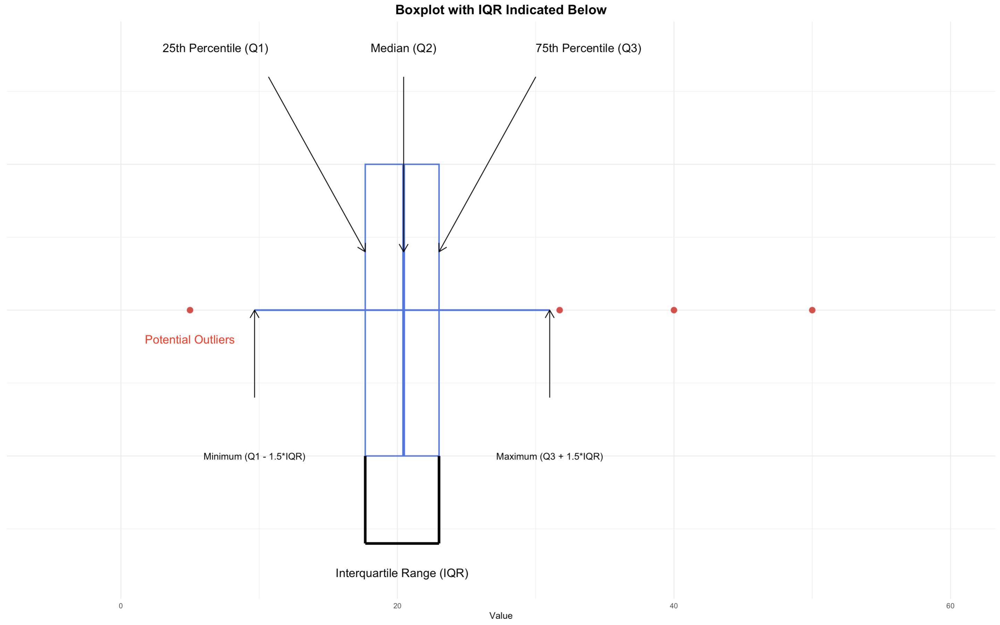

# Laboratori. Sessió 1. {-}

```{r, libraries, echo=FALSE, warning=FALSE}
##install.packages("vembedr")
library("vembedr")
```

# Intro

Per aquesta primera sessió de Lab és imprescindible tenir instal·lat R i RStudio. Si no és així, fes la instal·lació ara. Tens les instruccions d'instal·lació a Atenea.

## Per què R?

 - R és open source i gratuït 
 - R és multiplataforma: Mac, Windows, Linux i  Unix
 - La comunitat online és nombrosa i activa (foros, tutorials, manuals) 

- Si afegim una IDE (interface) com RStudio, guanyem usabilitat 

- Es pot combinar amb programes en altres llenguatges (C, C++, Fortran, Perl, Python, Java)

- Paquets contribuïts

## Context

- Hi ha d'altres llenguatges que són molt més ràpids que R
- R combina una potència suficient amb una sintaxi clara per càlcul estadístic i gràfics. 
- R és orientat a objectes i permet la manipulació d'estructures de dades complexes d'una manera compacta i eficient.  
- A nivell gràfic és potent
- La combinació amb LaTeX és ideal (RMarkdown, Quarto, Knitr) 
- L'instal.lació de nous paquets és generalment senzilla install.package(" ")
- Existeixen molts paquets específics disponibles
- El paquet s'instal.la una vegada, i es crida quan cal, de manera que no es sobrecarrega la memòria.


<!-- \begin{center} -->
<!--   \begin{tabular}{ccc} -->
<!--      \includegraphics[width=.1\linewidth]{../LOGOS/Rlogo.png} -->
<!--      & -->
<!--      \includegraphics[width=.2\linewidth]{../LOGOS/RStudio-Logo.png} -->
<!--    & -->
<!--      \includegraphics[width=.15\linewidth]{../LOGOS/r-packages.png} -->
<!--   \end{tabular} -->
<!-- \end{center}    -->

Aquest quadrimestre utilitzarem R en conjunt amb RStudio. Quan us digui "ara obrim R", no farem servir la interfície de R, sino que  entrarem directament a la IDE de RStudio. Ara, fem les primeres passes amb R+RStudio:

# Comencem 

## RStudio 
La pantalla de RStudio s'estructura en quatre blocs, tot i que la primera vegada que l'utilitzem en veurem només tres.



Podem escriure codi a la Consola; veurem els objectes definits a l'Environment i veurem fitxers, figures, paquets o l'ajuda al quart bloc.

En les primeres passes utilitzarem la consola. En el moment en què comencem a escriure codi en scripts, us apareixerà el quart bloc.

## Cal ser ordenats. Directori de treball.

Quan el el vostre dia a dia utilitzeu programes informàtics, sovint no us cal saber on estan emmagatzemats els fitxers que s'estan utilitzant. 
A les sessions de Lab volem fer un ús *professional* de les eines informàtiques, i per tant sí és important ser endreçats i saber on són els fitxers que utilitzarem.

Quan li demanem a R que obri un fitxer, el buscarà al Directori de treball (Working directory). Per tant, és molt important que fixem aquest directori de treball quan iniciem la sessió.

Cal saber on ens baixem els fitxers de la sessió de Laboratori: els meus documents, l'escriptori, una carpeta de l'assignatura... No importa on, però sí saber on són els fitxers.

Per començar, veurem el Mètode 1, on fem el procés complert per a fixar el directori de treball. 

Mètode1: A la pestanya `Files`, cliquem sobre els tres punts. S'obrirà una finestra que ens permetrà navegar a la carpeta que conté els fitxers. Cliquem seleccionar. Veurem el contingut a la finestra. Però encara cal el segon pas: cliquem sobre la icona de rodeta dentada i seleccionem `Set as working directory`. Veurem que a la consola apareix la instrucció `setwd(ruta del directori)`. Ara ja estem preparats.

```{r, screencastWD, echo=FALSE}
embed_youtube("MxN4o39G6L8")
```

\vspace{0.3cm}

::: {.infobox .caution data-latex="{caution}"}

***ATENCIÓ! Ara has d'establir el directori de treball per a la sessió d'avui***
::: 

\newpage

# Bàsics molt bàsics de R 

Donarem els primers passos amb R escrivint a la Consola, i posteriorment obrirem el nostre primer script de R. 

## Bàsics

En la configuració per defecte de la IDE de RStudio la Consola apareix a la part inferior de la pantalla:



A la consola podem escriure:

-  'demo()' per algunes demos; demo(image) , demo(graphics)
- 'help()' per ajuda, 'help.start()' per ajuda HTML 
<!-- -  'q()' per sortir (quit) de R des de consola -->

### 🖊Exercici

Fes servir aquestes sentències a la teva consola.

## Primeres passes en R 

Amb R podem fer operacions matemàtiques bàsiques. A partir d'ara el text et mostrarà parts de codi, _chunks_, que apareixen amb fons gris, i els resultats corresponents de la seva execució. 

### Operacions bàsiques

Podem fer operacions matemàtiques bàsiques. Només ens cal escriure l'operació i clicar _Enter_

```{r two-plus-twoex, echo=TRUE}
2+2
sqrt(16)
```
### 🖊Exercici

Replica les operacions mostrades als _chunks_ anteriors a la teva consola.

### 🖊Exercici

Ara, escriu al següent _chunk_ el codi R que necessitem per a sumar tres més tres: 

```{r tres-mes-tres, exercise=TRUE}

```

Si executem instruccions a la Consola, aquestes instruccions i valors no s'emmagatzemen enlloc. Per tant, ens convé utilitzar _scripts_:

## Ús d'scripts 

Un script és un fitxer de text que conté instruccions de R. Es guarda amb extensió *.R.

Generarem un nou script des del menú Fitxer (`File -> New file -> RScript`). (Obs: més endavant utilitzarem d'altres formats de fitxer, com RMarkdown).

Ara ja disposem de la quarta finestra a RStudio:



Si volem executar una instrucció continguda en un script caldrà donar-li al botó Executar (`Run`) o prémer Ctrl+Enter. No cal que estem a final de línia.

Útil: Tota línia que comenci amb el símbol de cardinal (hashtag) és una línia comentada. Ens pot resultar útil per afegir informació sobre la sentència que hem escrit.

### 🖊Exercici 
Genera un fitxer d'script nou. Executa les sentències bàsiques utilitzades abans a la consola.

A partir d'ara guardarem les instruccions a scripts i ocasionalment podrem utilitzar la consola si no ens interessa guardar la sentència que hem executat.

## Primers objectes 

Ara ja sabem fer operacions bàsiques. Si volem reutilitzar el resultat d'aquesta operació, pot resultar útil assignar-li un nom per tal d'utilitzar-lo posteriorment:

```{r def-vec-ex, echo=TRUE}
nomval<- 2+2
nomval
```

Podem definir també vectors, utilitzant l'operador c (concatenar):

```{r def-vec-ex2, echo=TRUE}
nomvec<-c(2,4,5)
nomvec
```

Un cop definir un objecte, podem comprovar quin és el seu format intern:

```{r def-vec-ex3, echo=TRUE}
typeof(nomvec)
is.vector(nomvec)
```

Veiem ara com podem utilitzar l'ajuda. Volem generar una seqüència de 20 valors entre 1 i 10, i sabem que la instrucció que hem de fer servir és `seq`. Però com sabem quin són els arguments que hem d'indicar a la aquesta funció per obtenir el format desitjat? Donat que utilitzem RStudio, quan comencem a escriure el nom de la funció ens apareixen suggeriments de funcions que comencen amb aquests caràcters, i la seva estructura. Alternativament, podem cridar l'ajuda de les funcions actives utilitzant el símbol interrogant davant del nom de la funció, per exemple `?seq`, si la funció està inclosa en un paquet actiu, o bé  dos interrogants, per exemple `??seq`, si la funció està inclosa en un paquet instal·lat però no actiu. En aquest cas, `seq` està continguda en el paquet base de R, que s'activa per defecte.

```{r def-vec-seqhelp, exercise=TRUE}
?seq
```

Aquí veiem que els arguments que hem d'utilitzar per generar la sèrie desitjada són `from, to i length.out`. Generarem la sèrie i li donem nom. Per obtenir el resultat només hem d'escriure el nom de la sèrie:

```{r def-vec-seq, exercise=TRUE}
nomvec2<-seq(from=1, to=10, length.out=20)
```

### 🖊Exercici 
Genera una seqüència de 1 a 100, amb els valors cada 0.5.

```{r seq-1-100-05, exercise=TRUE}

```

# Gestió de Dades i data Frames

Tot i que en la majoria de casos les dades que utilitzarem estaran incloses en fitxers externs, en algunes ocasions ens pot interessar utilitzar les dades d'exemple contingudes en llibreries. Donarem les nostres primeres passes d'anàlisi de dades amb un d'aquests conjunts de dades.

## Dades contingudes en llibreries: `mtcars`
En la nostra instal·lació bàsica de R  s'inclouen algunes llibreries (també anomenades paquets) per defecte. Ocasionalment instal·larem noves llibreries que ens proporcionin funcionalitats específiques. Més endavant veurem com.

Algunes de les llibreries contenen conjunts de dades. A continuació utilitzarem una d'aquestes llibreries ja disponibles: `mtcars`. Veurem algunes operacions bàsiques amb R utilitzant les dades incloses a l'objecte de dades `mtcars`, que conté observacions de característiques tècniques d'alguns models de cotxe americans.

```{r cridamtcars, echo=TRUE}
data(mtcars)
```

Una vegada que hem executat la instrucció veurem que a la pestanya `Environment` ens apareix l'objecte `mtcars`, que inclou 32 observacions d' 11 variables.

## Exploració de dades 
Podem visualitzar les primeres sis línies del fitxer de dades utilitzant la instrucció head:

```{r headmtcars, echo=TRUE}
head(mtcars)
```

Aquest format d'organització de les dades s'anomena `data frame`. Podem comprovar si el conjunt de dades té aquest format:

```{r mtcarsdf, echo=TRUE}
is.data.frame(mtcars)
```

Els data frame organitzen la informació en files i columnes. Cada fila correspon a un individu i cada columna a una variable mesurada en aquell individu.
(Actualment existeixen altres formes d'organitzar la informació. De moment al Lab utilitzarem estructures molt bàsiques).

Ens podem referir a la informació continguda al data frame utilitzant una crida de tipus matricial, per files i columnes. Observeu que aquí utilitzem el *hashtag* per a fer comentaris sobre les sentències mostrades:

```{r mtcarsmatricial, echo=TRUE}
#Totes les dades . Observeu la coma separant files i columnes
mtcars[ , ]
#Segona fila i totes les columnes
mtcars[2, ]
#Totes les files i segona columna
mtcars[, 2]
#Segona fila i segona columna
mtcars[2 , 2]
#Totes les files i totes les columnes excepte la segona
mtcars[ , -2]
```

També podem referir-nos a més d'una fila / columna, tot i que no siguin consecutives:

```{r mtcarsmatricial2, echo=TRUE}
#Segona i tercera columnes
mtcars[, 2:3]
#Segona i quarta columnes
mtcars[, c(2,4)]
# Totes les columnes excepte la segona i la quarta
mtcars[, -c(2,4)]
```

Aquesta referència per ordre és pràctica, però si reorganitzem el fitxer de dades, el nostre codi pot quedar inservible. És recomanable cridar les variables pel seu nom.

Podem saber els noms de les variables contingudes al data frame:

```{r mtcarsnames, echo=TRUE}
names(mtcars)
```

D'aquesta manera, podem referir-nos a les variables pel seu nom:

```{r mtcarsnamesn, echo=TRUE}
mtcars[, "mpg"]
mtcars[, c("mpg", "gear")]
```

També ens podem referir a una variable utilitzant l'operador dòlar. De fet, si escrivim el nom del data frame i el símbol de dòlar, RStudio ens suggerirà els noms de totes les variables incloses en aquest data frame:

```{r mtcarsnamesn2, echo=TRUE}
mtcars$mpg
```

### 🖊️Exercici: Conjunt de dades `iris`
Crida el conjunt de dades `iris` i practica crides amb format matricial.

1. Mostra els noms de les variables del conjunt `iris`.
2. Mostra les primeres línies del conjunt de dades.

```{r exercici-iris,  exercise=TRUE, exercise.has_hint=TRUE}

```

```{r exercici-iris-hint, echo=FALSE}
Pots utilitzar les funcions `data()` `names()` i `head()` per completar aquest exercici.

```

## Segon pas: Llegir dades 

::: {.infobox .travel data-latex="{travel}"}

***Cal tenir definit el directori de treball. El fitxer de dades que volem obrir ha d'estar contingut al directori de treball***

::: 

\vspace{0.5cm}

Les dades que utilitzarem estan contingudes en un fitxer amb extensió `*.csv` (coma separated values). Són fitxers tipus text amb delimitació entre columnes. Són molt utilitzats perquè es pot emmagatzemar molta informació amb poc pes.

La separació entre columnes per defecte és la coma. Però si el fitxer ha estat generat en un ordinador amb sistema d'arxius en castellà o català, la separació pot ser punt i coma per evitar conflictes amb el símbol decimal.

Si dediquem uns segons a obrir el fitxer amb el bloc de notes, veurem la seva estructura i serà molt més senzill obrir-lo correctament des de R.

::: {.infobox .circle data-latex="{circle}"}

***Obre el fitxer amb el Bloc de Notes o similar, NO amb MSExcel. Observa l'estructura del document: quina és la separació entre columnes? Té encapçalament? Hi ha fileres amb observacions que haguem de saltar? Quin és el símbol decimal? ***
:::

Ara procedirem a obrir el fitxer de dades tenint en compte la seva estructura. Guardarem el contingut en un objecte anomenat dades:

```{r lecturadades, echo=TRUE}
dades <- read.table("dades-2425-tots-mod-red.csv", sep = ";", header = TRUE)
```

Observeu que ha aparegut l'objecte dades a l'`Environment`. Si cliquem a l'icona de la graella que apareix al costat, podrem inspeccionar per a comprovar que s'ha importat correctament.

L'objecte dades és un data frame. Aquesta és una estructura de dades comuna de R-base.

```{r lecturadades2, echo=TRUE}
is.data.frame(dades)
```

Podem accedir a la informació continguda al data frame de la mateixa manera que hem vist al capítol anterior.

### 🖊Exercici 
 Escriu aquí el codi per obtenir els noms de les variables de l'objecte dades:

```{r exercici-3-noms, exercise=TRUE}

```

### 🖊Exercici: Crida de variables

Mostra la primera variable del conjunt de dades `dades`.

```{r exercici-3-primera-var, exercise=TRUE, exercise.has_solution=TRUE}

```

```{r exercici-3-primera-var-solution, echo=FALSE}
names(dades)
dades$Alt
```

# Estadística descriptiva: resums numèrics 

Les representacions gràfiques ens permeten una comprensió global de les dades, però sempre cal complementar amb els resums numèrics.

## Resums numèrics

Mitjançant la funció `summary` cridem els estadístics descriptius bàsics del data frame complert: 

```{r descripnum, echo=TRUE}
summary(dades)
summary(dades$Alt)
summary(dades[,1])
```
Observeu que per defecte la funció ens proporciona un resum de totes les variables contingudes al data.frame, que poden ser moltes. Si la variable és numèrica es proporcionen 6 estadístics (Mínim, màxim, mitjana aritmètica, mediana, primer quartil i tercer quartil). Si la variable és de tipus text s'indica i si la variable és un factor, es proporciona la freqüència de cadascun dels seus nivells. També podem fer un resum d'una variable en concret, bé cridant-la pel nom o en format matricial:

```{r descripnumuna, echo=TRUE}
summary(dades$Alt)
summary(dades[,1])
```
::: {.infobox .caution data-latex="{caution}"}

Observeu que la variable Alt presenta tres valors, `NA`, not available. `NA` és una notació estàndar de R per a aquelles observacions no disponibles. Si registrem les dades utilitzant equip electrònic, podríem trobar altres codis de no disponibilitat (p.ex. -9999.999). Quan emmagatzemem l'informació, cal evitar les caselles aparentment buides. Si no hi ha informació, `NA`.

:::

Si no necessitem tots aquests descriptius, o necessitem un no inclòs a la llista, podem cridar funcions específiques que ens proporcionin  les mesures descriptives:

```{r descripnum2, echo=TRUE}
mean(dades$Alt) #mitjana sensible valors extrems. Què passa si tenim algú de 2m?
median(dades$Alt)
var(dades$Alt) #variança mostral dividint per n o per n-1?
sd(dades$Alt)
```

Algunes d'aquestes funcions són sensibles a la presència de valors `NA` (not available). Per això podem utilitzar l'argument `na.rm` (NA remove) per a calcular el corresponent descriptiu dels valors que no són NA:

```{r descripnum4, echo=TRUE}
#quantile(dades$Alt) #dóna error per NA
quantile(dades$Alt, na.rm=TRUE) #quartils
quantile(dades$Alt, probs = seq(0, 1, 1/10),na.rm=TRUE)    # Deciles
quantile(dades$Alt, probs = c(0.05,0.95),na.rm=TRUE) # Percentil 5 i 95
```

## Descriptiva: representacions v.a. contínues

### Histograma 

Donada una variable quantitativa contínua com les alçades, podem representar-la utilitzant un histograma de freqüències:

```{r hist, echo=TRUE}
hist(dades$Alt)
```

::: {.infobox .circle data-latex="{circle}"}
És important observar l'histograma i preguntar-nos: és simètric? Quina és la mediana? Quina és la classe modal? On es troba el centre de masses?
:::

### Boxplot 
Una altra representació gràfica molt útil és el diagrama de caixa o boxplot.

Recorda que el boxplot ens dóna una idea de la variabilitat de les dades, mostrant els tres quartils i la dispersió. És una bona eina per a detectar possibles valors atípics (_outliers_ en anglès).



```{r boxplot, echo=TRUE}
boxplot(dades$Alt)
```

::: {.infobox .circle data-latex="{circle}"}

Donat el boxplot, cal observar-lo i preguntar-nos: hi ha punts atípics (*outliers*)? Quin és el rang interquartílic? La distribució és simètrica? 
(Obs: Actualment s'utilitzen força els gràfics tipus violí, que aporten una millor visualització. En veurem un exemple al material extra).

:::

### 🖊️Exercici: Representació histograma

Representa un histograma d'una de les variables del conjunt de dades `dades`:

```{r exercici-histograma, exercise=TRUE, exercise.has_hint=TRUE}

```

```{r exercici-histograma-hint, echo=FALSE}
Pots utilitzar la funció `hist()`

```

### 🖊️Exercici: Representació Boxplot

Representa un boxplot d'una altra variable del conjunt de dades `dades`.

```{r exercici-boxplot-altre, exercise=TRUE, exercise.has_hint=TRUE}
```

```{r exercici-boxplot-altre-hint, echo=FALSE}
Pots utilitzar la funció `boxplot()`
```

## Descriptiva: Variables qualitatives (factors) 

Les variables quantitatives reben el nom de factors en context R. Els diferents valors que pot prendre el factor s'anomenen nivells. El programa sol identificar els factors com a tals en alguns casos, però sempre cal verificar que la identificació hagi estat correcta en particular en dues situacions: 1) Quan els nivells del factor estan definits numèricament, donat que el factor por ser identificat com a una variable numèrica discreta 2) Quan hi ha molts nivells en el factor, perquè la variable es pot identificar com caràcter.

Estudiarem la variable color d'ulls:

```{r quant, echo=TRUE}
summary(dades$Ulls) #identifica la variable com un caràcter. És un factor
```

Si posteriorment no necessitem utilitzar aquesta variable com a factor sempre, podem utilitzar la funció `as.factor`; o bé definir una nova variable amb estructura factor, que pot sobreescriure la ja existent:

```{r quant1, echo=TRUE}
summary(as.factor(dades$Ulls)) #solució només per aquesta representació
#per usos posteriors, guardarem la variable com a factor
dades$Ullsfactor<-as.factor(dades$Ulls)#nova variable al df
dades$Ulls<-as.factor(dades$Ulls)#sobreescriure variable existent
summary(dades$Ulls)
```

```{r quant2, echo=TRUE}
plot(dades$Ulls) #observem que els NA no són un nivell del factor
```

::: {.infobox .circle data-latex="{circle}"}

Observeu els nivells del factor. Què fem amb el nivell Preciosos? 
:::

## Descriptiva: Factors i variables quantitatives 

Les variables quantitatives es poden utilitzar per observar matissos en variables quantitatives. Per exemple, podem estudiar les alçades en els diferents grups classe.

Per això, cal identificar el grup com a factor (situació anàloga al cas del color d'ulls).

Podem representar les alçades respecte els diferents nivells del factor utilitzant el símbol tilde. La funció `plot` és un contenidor genèric que realitza una representació gràfica diferent depenent del tipus de variable que conté. Això és pràctic, però no sempre obtenim les representacions que voldríem. En aquesta combinació particular, `plot` ens representa un boxplot de les alçades segons el grup classe:

```{r combinaciofactor, echo=TRUE}
plot(dades$Alt~as.factor(dades$Grup)) 
```

::: {.infobox .circle data-latex="{circle}"}

Quan vàrem representar les alçades de tots els grups, hi apareixien _outliers_? Com interpretem els _outliers_ que observem ara als diagrames de caixa?
:::

En lloc de la instrucció genèrica, podem cridar la instrucció específica per a representar el boxplot respecte del factor, en aquest cas el nombre de germans:

```{r boxplotcombinaciofactor, echo=TRUE}
boxplot(dades$Alt~dades$Germans)
```

### 🖊Exercici 

Representa un boxplot de la variable `Alt` respecte a la variable `Ulls` del conjunt de dades.

```{r exercici-boxplot-alt-ulls, exercise=TRUE, exercise.has_solution=TRUE}
```

```{r exercici-boxplot-alt-ulls-solution, echo=FALSE}
plot(dades$Alt~dades$Ulls)
```

### 🖊Exercici 

Representa un histograma i un boxplot per a una altra variable del conjunt `dades`.  
Pots escollir una variable que no sigui`Alt`.

```{r exercici-plots-altres-vars, exercise=TRUE, exercise.has_hint=TRUE}
```

```{r exercici-plots-altres-vars-hint, echo=FALSE}
\text{Pots utilitzar:
- `hist()`  per fer un histograma.
- `boxplot()` per fer un boxplot.}
```


# Extra: Plots amb `ggplot`

Aquest apartat és extra, i només pretèn mostrar-vos que, tot i que nosaltres ens centrem en la interpretació dels gràfics i no en la seva estètica, és possible generar gràfics atractius utilitzant l'eina.

Les representacions gràfiques proposades al llarg del LAb són les corresponents al paquet base de R, perquè els arguments són fàcils d'entendre i ens permeten la primera aproximació als conceptes. Però des de l'aparició de la la filosofia `tidyverse` d'organització de la informació a R, i el paquet gràfic `ggplot`, aquest format gràfic s'ha convertit en el més utilitzat a la comunitat R.

A continuació us mostrem alguns exemples de gràfiques descriptives realitzades amb aquestes llibreries. Més endavant podem dedicar una sessió a explicar-ne el funcionament.

## Plots amb `ggplot`

En primer lloc cridarem les llibreries necessàries. En properes sessions veurem que és preferible situar les llibreries extra que cridem en les primeres línies del codi del nostre script. En aquest cas, i de manera excepcional,  ens saltem la norma de col·locar aquestes llibreries al principi del codi. 

```{r llibreriesextra, echo=TRUE}
#install.packages("extrafont")
library(extrafont)
#extrafont::font_import()
#extrafont::loadfonts()
#extrafont::loadfonts(device="pdf")
#extrafont::loadfonts(device="postscript")
#loadfonts(device = "win")
#font_import(paths = NULL, recursive = TRUE, prompt = TRUE,pattern=NULL)
library(tidyverse)
library(hrbrthemes)
library(viridis)
```
Creem un conjunt de dades artificial per a mostrar les representacions gràfiques:

```{r extradataset, echo=TRUE}
data <- data.frame(
  name=c( rep("A",500), rep("B",500), rep("B",500), rep("C",20), rep('D', 100)  ),
  value=c( rnorm(500, 10, 5), rnorm(500, 13, 1), rnorm(500, 18, 1), rnorm(20, 25, 4), rnorm(100, 12, 1) )
)
```

## Boxplot amb `ggplot` 

Podem representar un Boxplot bàsic:

```{r boxplotggplot, echo=TRUE}
data %>%
  ggplot( aes(x=name, y=value, fill=name)) +
    geom_boxplot() +
    scale_fill_viridis(discrete = TRUE, alpha=0.6, option="A") +
    theme_ipsum() +
    theme(
      legend.position="none",
      plot.title = element_text(size=11)
    ) +
    ggtitle("Basic boxplot") +
    xlab("")
```

## Boxplot amb `ggplot` i dades 

Alguns autors recomanen representar el boxplot conjuntament amb les dades, per poder-lo interpretar millor:

```{r boxplotggplotjitter, echo=TRUE}
data %>%
  ggplot( aes(x=name, y=value, fill=name)) +
    geom_boxplot() +
    scale_fill_viridis(discrete = TRUE, alpha=0.6) +
    geom_jitter(color="black", size=0.4, alpha=0.9) +
    theme_ipsum() +
    theme(
      legend.position="none",
      plot.title = element_text(size=11)
    ) +
    ggtitle("A boxplot with jitter") +
    xlab("")
```

## Violin plot 

La gràfica violí és una alternativa moderna al Boxplot:

```{r violinplotggplot, echo=TRUE}
data %>%
  ggplot( aes(x=name, y=value, fill=name)) +
    geom_violin() +
    scale_fill_viridis(discrete = TRUE, alpha=0.6, option="A") +
    theme_ipsum() +
    theme(
      legend.position="none",
      plot.title = element_text(size=11)
    ) +
    ggtitle("Violin chart") +
    xlab("")
```

# Conclusion {-}

Amb aquest apartat hem acabat el contingut del Lab1. Pots tornar enrere per a repassar conceptes, o passar al Lab Entregable.

# About / Canvis {-}

Material creat per M. Ortego per les Assignatures de l'àmbit estadístic de l' ETSECCPB - UPC.

Versió 1.0

# Credits  {-}

Algunes de les icones utilitzades han estat obtingudes de repositoris online:

<a href="https://www.flaticon.com/free-icons/travel" title="travel icons">Travel icons created by IconBaandar - Flaticon</a>

<a href="https://www.flaticon.com/free-icons/alert" title="alert icons">Alert icons created by Creatype - Flaticon</a>

<a href="https://www.flaticon.com/free-icons/find" title="find icons">Find icons created by hqrloveq - Flaticon</a>

<!-- Fi contingut -->

<!--A continuació chunk css per no ensenyar apartats.
Sembla que amb crida css no funcionava-->
```{css echo=FALSE}
@media print {
  .topicsContainer,
  .topicActions,
  .exerciseActions .skip {
     display: none;
  }
  .topics .tutorialTitle,
  .topics .section.level2,
  .topics .section.level3:not(.hide) {
   display: block;
  }
  .topics {
   width: 100%;
   }
   .tutorial-exercise, .tutorial-question {
     page-break-inside: avoid;
   }
   .section.level3.done h3 {
     padding-left: 0;
     background-image: none;
   }
  .topics .showSkip .exerciseActions::before {
    content: "Topic not yet completed...";
    font-style: italic;
  }
}
 
```    

<!-- Fi document -->